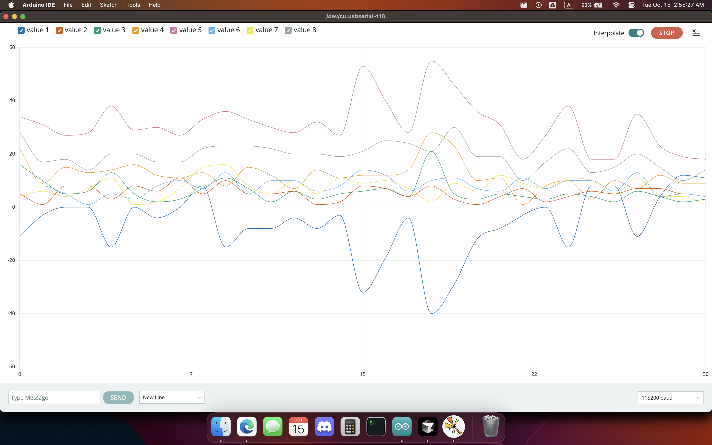

# NeuroFocus V2.0 README

## For quick start

### Requiements:

- Python 3.10
- Arduino IDE
- Brain

Just upload arduino_main_code/FFT_EEG_DC_32Hz/FFT_EEG_DC_32Hz.ino



Create virutal environment

```bash
python -m venv venv
```

Activate the virtual environment

```bash
source venv/bin/activate
```

Then install the required python packages

```bash
pip install -r requirements.txt
```

Then connect the arduino to the computer and check the port number in the python code and run main.py

```bash
python main.py
```


## Overview

This codebase contains Arduino sketches and Python scripts for interfacing with hardware components, such as sensors and LEDs, and visualizing data using Python. The primary components include:

1. **Arduino Sketches**: These are used to read sensor data and control hardware components like LEDs.
2. **Python Notebooks**: These are used for data visualization and analysis.

## Arduino Sketches

### `classic_bluetooth_test.ino`

This sketch sets up a classic Bluetooth connection using the `SoftwareSerial` library to transmit sensor data from an analog pin. The data is sent over Bluetooth and printed to the Serial Monitor.

#### Key Components:

- **SoftwareSerial**: Used for Bluetooth communication.
- **Analog Pin (A0)**: Reads sensor data.
- **Serial Communication**: Transmits data at 9600 baud rate.

### `led_test`

This sketch reads data from an analog sensor and controls three LEDs based on the sensor value. It also blinks an additional LED at a set interval.

#### Key Components:

- **LED Control**: LEDs are turned on or off based on sensor values.
- **Blinking LED**: An LED blinks at a 5-second interval using a non-blocking approach with `millis()`.

## Python Notebooks

### `32bit_datapoints_test.ipynb`

This notebook is used for visualizing data received from a serial port. It sets up a real-time plot to display data from 32 frequency bins over time.

#### Key Components:

- **Serial Communication**: Connects to a specified serial port.
- **Matplotlib**: Used for plotting data in real-time.
- **Data Handling**: Processes and visualizes data in a rolling window format.

### `serial_test.ipynb`

This notebook reads data from a serial port and plots it in real-time. It also saves the data to a CSV file when the plot window is closed.

#### Key Components:

- **Serial Communication**: Reads data from a specified serial port.
- **Real-time Plotting**: Uses `matplotlib` to update plots dynamically.
- **CSV Export**: Saves data to a CSV file upon closing the plot.

## Setup and Usage

### Arduino Sketches

1. **Hardware Setup**: Connect your Arduino to the necessary hardware components (e.g., sensors, LEDs).
2. **Upload Sketch**: Use the Arduino IDE to upload the desired sketch to your Arduino board.
3. **Monitor Output**: Use the Serial Monitor or a Bluetooth terminal to view the transmitted data.

### Python Notebooks

1. **Install Dependencies**: Ensure you have the required Python packages installed. You can use the `requirements.txt` file to install them:
   ```bash
   pip install -r requirements.txt
   ```
2. **Run Notebooks**: Use Jupyter Notebook or Jupyter Lab to open and run the notebooks.
3. **Connect to Serial Port**: Ensure your device is connected to the correct serial port specified in the notebook.

## Dependencies

- **Arduino**: Requires the Arduino IDE for uploading sketches.
- **Python**: Requires Python 3.10 or later.
- **Python Packages**: Listed in `requirements.txt`, including `pyserial`, `matplotlib`, and others.

## Troubleshooting

- **Serial Port Issues**: Ensure the correct serial port is specified in the Python notebooks.
- **Kernel Crashes**: Check the Jupyter logs for more details and ensure all dependencies are correctly installed.

## License

This codebase is open-source and available under the MIT License. Feel free to use and modify it as needed.
